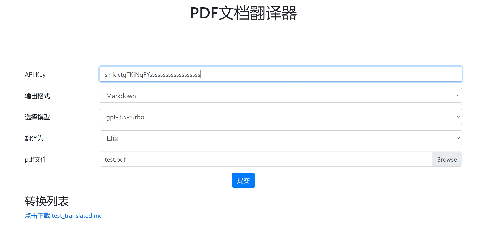

# pdf翻译器
基于django实现的pdf翻译器，支持在线翻译，支持pdf文件上传，支持译文下载

在线体验：http://170.106.103.16:13003/

# 安装
安装方式和django项目的安装方式一样，直接clone项目，创建虚拟环境，安装依赖，然后运行项目

运行成功，假定端口是8000，访问127.0.0.1:8000

# 使用
如图，输入自己openai的api key, 选择语言，要翻译的源文件，点击翻译，等待翻译完成，点击下载译文

译文就是转换列表下面.



# API访问
转换
```shell
curl --request POST \
  --url http://127.0.0.1:8000/translate \
  --header 'content-type: multipart/form-data' \
  --form apiKey=sk-123 \
  --form format=markdown \
  --form model=gpt-3.5-turbo \
  --form 'language=中文' \
  --form 'file=@G:\openai-translator\tests\test.pdf'
```
转换成功会返回一个译文的文件名，调用下载接口下载，如下：
```shell
curl --request GET \
  --url 'http://127.0.0.1:8000/download?filename="返回的文件名"'
```